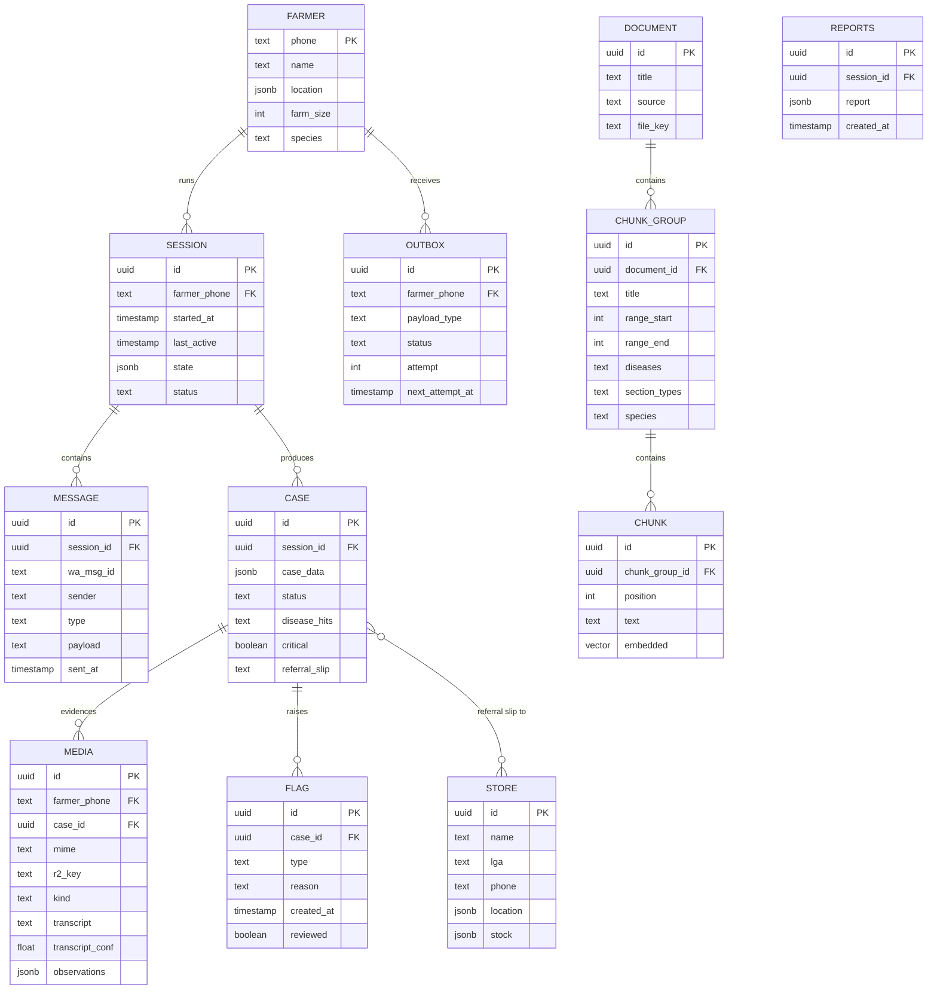

# Poultry Advisory Agent — Stack & Deployment (Locked)

> Status: fully locked. Last decisions closed: Cloudflare Workers core · Gemini free embeddings @ 768 dims · OpenRouter free Pidgin transcription · single Node bridge for Baileys.

---

## 1. Language & tooling

| | Choice |
|---|---|
| Language | **TypeScript (strict)** |
| Package manager / workspace | **pnpm monorepo** |
| Node | 22 LTS (bridge) · wrangler for Workers |
| Formatter/linter | Prettier + ESLint (typescript-eslint) |
| Tests | **Vitest** (+ msw for API tests) |

## 2. Repo layout

```
poultry-agent/
├─ apps/
│  ├─ api/          → Hono (deploys to Cloudflare Workers) · Drizzle · Zod
│  │                  · pino · Langfuse · Sentry · Cron Triggers
│  └─ web/          → React + Vite (deploys to Cloudflare Pages) · useChat · Tailwind
├─ packages/
│  ├─ core/         → orchestrator · session_state · validateCase() · missing()
│  ├─ schemas/      → Zod contracts (InboundMessage · case · media · outbox)
│  ├─ rag/          → ingestion · retrieval (pgvector) · analyze_document
│  └─ bridge/       → WhatsApp: Baileys + normalize() (Node process)
├─ diagrams.mmd · SYSTEM_DESIGN.md · STACK.md
```

## 3. Runtime matrix (who runs what)

| Piece | Runs on | Notes |
|---|---|---|
| Hono API · orchestrator · tools · RAG · media ingest · cases · analytics · auth | **Cloudflare Workers** | stateless; handlers + Cron Triggers |
| Dashboard + web chat UI | **Cloudflare Pages** (static React) | `useChat` streams directly from the API route |
| WhatsApp bridge (Baileys) | **ONE Node process** (fly-io/Railway/Render free) | long-lived socket, QR pairing, reconnect, polls outbox |
| Postgres + pgvector | **Neon** (free tier) | 12 tables, TCP from Worker |
| Media evidence + uploaded docs | **Cloudflare R2** | `media/{phone}/{date}/{uuid}` keys |
| Embeddings | **Google AI Studio** `text-embedding-004` @ **768 dims** (free, ~1,500 req/day) | hosted API from Worker |
| Transcription | **OpenRouter free multimodal router** + dynamic Pidgin prompt | fallback: `openai/whisper-1` w/ `en` hint (~$0.0045/min) |
| Scheduled jobs | **Workers Cron Triggers** | surveillance digest · outbox liveness |

**Why a Node bridge at all:** Cloudflare Workers are stateless/short-lived. Baileys needs a *persistent* WebSocket + session/QR state, which cannot live on a Worker. The bridge is a ~150-line dumb pipe (has no orchestrator/DB/LLM logic) and is behind the `normalize()` + outbox interface so the official WhatsApp API can replace it later with zero changes to the API core.

## 4. LLM & AI services

| Need | Provider / model | Notes |
|---|---|---|
| Chat + tools + vision | OpenAI `GPT-4o-mini` | structured output; used for chat, tool calls, `analyze_image` |
| Embeddings | Google `text-embedding-004` → **768 dims** | vine: column frozen to 768; model identical at ingest & query |
| Pidgin transcription | OpenRouter free multimodal + prompt | keeps Pidgin verbatim ("wetin you dey talk" stays as spoken); conf < 0.6 → farmer confirms |
| Fallback transcription | OpenRouter `openai/whisper-1`, `en` hint | pennies; never auto-translate to formal English as primary |
| Pipeline: `analyze_document` (ingestion map-call) | OpenAI `GPT-4o-mini` | 1 LLM call per doc; deterministic split after |

## 5. Data layer (Postgres + pgvector on Neon) — full schema



## 6. Observability (locked)

| Tool | Role | Wiring |
|---|---|---|
| Langfuse | LLM traces · tokens · cost · replay | `@langfuse/vercel-ai-sdk` wraps LLM+tools |
| Sentry | exceptions across API/bridge/dashboard | `@sentry/node` on Hono + bridge, `@sentry/react` on web |
| pino | structured logs w/ `session_id`+`phone` | every handler; request logger middleware |
| `/health` `/ready` | liveness + deps (db·r2·embed) | continuous uptime monitor |
| Workers Cron | outbox liveness + surveillance digest | scheduled report flush |

## 7. Environment & secrets (never in repo)

`CLOUDFLARE_R2_*`, `DATABASE_URL` (Neon), `OPENAI_API_KEY`, `GOOGLE_AI_STUDIO_KEY`, `OPENROUTER_API_KEY`, `SENTRY_DSN`, `LANGFUSE_*`, admin `AUTH_SECRET`. Validated at boot with a Zod env-schema.

## 8. Free-tier budget check (why this survives a hackathon + demo)

- Neon: ~512 MB storage, thousands of vectors @ 768 dims fits easily, 24h pause/unpause.
- Gemini embeddings: 1,500 req/day ≫ a demo's needs.
- OpenRouter free router: $0 for transcription + (optional) models.
- R2 free: 10 GB objects, 1M class-A ops.
- Workers free: 100k req/day, 3 Cron Triggers.
- Bridge: one small free instance on fly-io/Railway.

**Total running cost: ~$0 for the entire demo.**